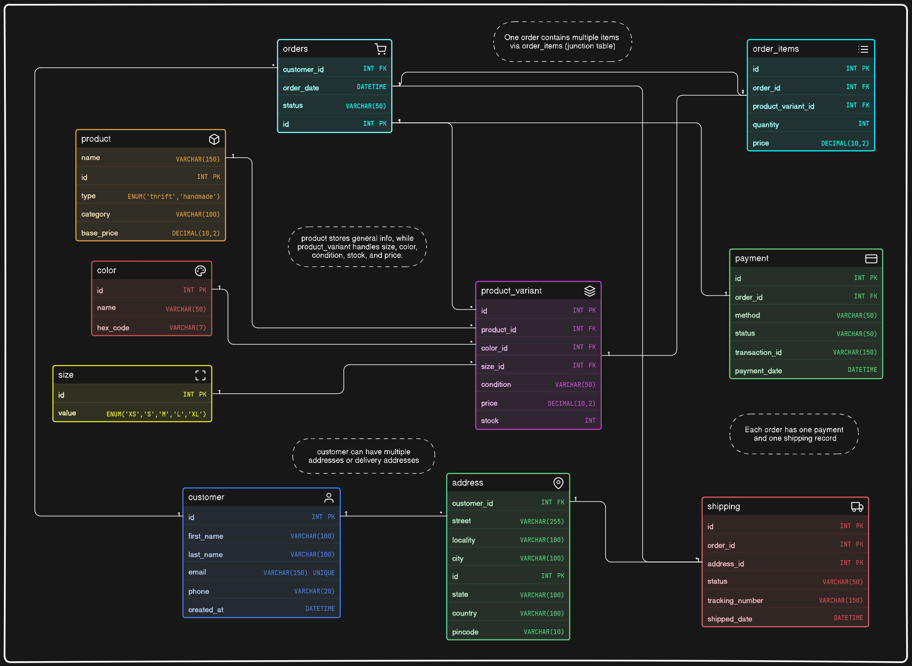

# thrift-store-er-model

This is a database design for a small instagram based thrift and handmade store.

Initially, the store was handling everything through DMs and whatsapp; but as things grow, managing products, orders and customers like that becomes messy.

so this is an attempt to structure that chaos.

---

## What this solves

* What products are being sold
* Which ones are thrift vs handmade
* How many pieces are available
* Which customer ordered what
* What items are inside an order
* Payment status
* Shipping status

---

## Entities

* customer
* address
* product
* product_variant
* color
* size
* orders
* order_items
* payment
* shipping

---

## Relationships (simple view)

* one customer : many orders
* one order : many items
* one product : many variants
* one variant : many order items

---

## ER-Diagram

